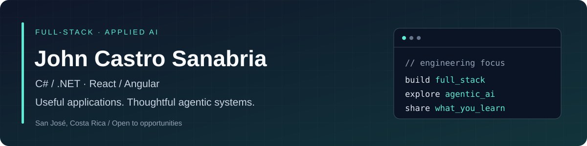

# Hi, I'm John 👋

**Full-stack Software Engineer · .NET + React / Angular · Applied AI & Agentic Systems**

I build applications around clear business rules, maintainable APIs and useful interfaces. Here you'll find banking and property-management projects, practical AI integrations and tools for agentic software engineering.

📍 **San José, Costa Rica** · Open to **full-stack .NET**, **AI application engineering** and **agentic systems** opportunities. Also open to **Java / Spring Boot** and **Python / Flask**.

**[Explore my portfolio ↗](https://full-stack-dev-johncastrosanabria.github.io/Portfolio/)** · [Watch technical demos](https://www.youtube.com/@JohnCastroTechLabs) · [LinkedIn](https://www.linkedin.com/in/john-castro-sanabria/) · [X / @JohnCS97](https://x.com/JohnCS97) · [Contact me](mailto:castrosanabriajohn2@gmail.com)

## 🚀 Try something first

**[Open the PropFlow demo →](https://full-stack-dev-johncastrosanabria.github.io/PropFlow/)**  
Explore rental workflows, tenants, payments and a dashboard. The hosted demo uses sample data in the frontend; no live backend is connected.

## Full-stack projects

| Project | Why explore it? | Stack |
| --- | --- | --- |
| [**PropFlow**](https://github.com/full-stack-dev-johncastrosanabria/PropFlow) | Property management with an interactive demo and documented backend. | ASP.NET Core · React · TypeScript · MySQL |
| [**Banking**](https://github.com/full-stack-dev-johncastrosanabria/Banking) | Accounts, transfers, a transaction ledger and administrator reversals. Explore the architecture and authorization decisions. | .NET · Angular · EF Core · PostgreSQL |
| [**NovaLeave**](https://github.com/full-stack-dev-johncastrosanabria/NovaLeave) | Vacation requests, role-based approvals, balance tracking and an audit trail. | ASP.NET Core MVC · Razor · SQL Server |

## 🤖 Applied AI & agentic engineering

- **[Docker Coding Agent](https://github.com/full-stack-dev-johncastrosanabria/docker-coding-agent-v1)** — bounded coding tasks in Docker Sandboxes, Claude/Codex backends, verification and completion reports. Start with the supported paths and V1 limitations in its README.
- **[BusinessAI-Analytics](https://github.com/full-stack-dev-johncastrosanabria/BusinessAI-Analytics)** — Spring Boot, React and Python/FastAPI for business dashboards, forecasting and chatbot workflows. Architecture and recorded demo inside.
- **[FlaskApiProduct](https://github.com/full-stack-dev-johncastrosanabria/FlaskApiProduct)** — Flask, SQLAlchemy and TypeScript for product/order APIs, analytics and chatbot integration. Includes setup and API documentation.

## 📚 Explore, learn & build

Interested in the same topics? Explore the Spanish-language learning resources:

**[C# / .NET learning path](https://github.com/full-stack-dev-johncastrosanabria/recursos-csharp-dotnet-nova-ai)** · **[Python → AI agents](https://github.com/full-stack-dev-johncastrosanabria/recursos-python-nova-ai)**

Guides, runnable examples and exercises to work through. For a reproducible bug or an improvement idea, open an issue in the relevant repository with the steps, expected result and actual result.

**Follow along for full-stack and agentic engineering projects.** If a repository helps you, star that project to find it again. For collaboration or opportunities, [let's connect](https://www.linkedin.com/in/john-castro-sanabria/).

<strong>Technical focus</strong>

- **Backend:** C#, .NET / ASP.NET Core, Entity Framework Core, REST APIs and SQL Server; Java / Spring Boot and Python / Flask.
- **Frontend:** React, Angular and TypeScript.
- **Architecture & delivery:** Clean Architecture, explicit business rules, authorization, testing, Azure DevOps and Docker.
- **AI systems:** tool-using agents, bounded execution, evaluation, verification and observable completion reports.

